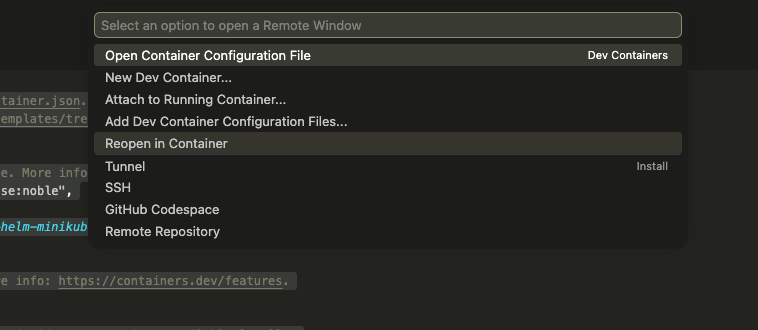
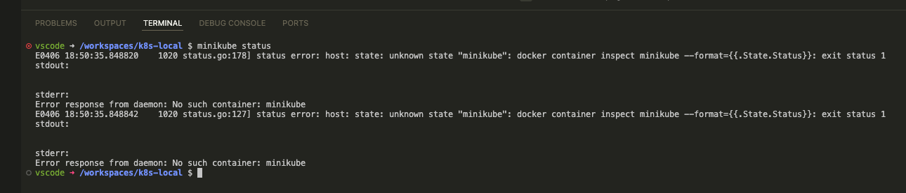
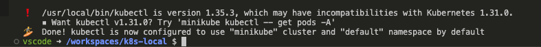

# Setup

## IDE

El IDE que utilizaremos en este curso será [VSCode](https://code.visualstudio.com/). Para instalarlo, navega a su [página de descarga](https://code.visualstudio.com/), donde encontrarás los instaladores para los principales sistemas operativos. Una vez descargada la versión deseada, procede con su ejecución e instalación.

## Git

Para comprobar si ya tienes Git instalado en tu sistema, abre una terminal y ejecuta el siguiente comando:

```bash
git version
```

Si el resultado no devuelve un mensaje similar al siguiente:

```
git version <installed version> <version type by OS>
```

Deberás instalarlo. Para ello, accede a la [página oficial](https://git-scm.com/install) y sigue las instrucciones específicas para tu sistema operativo.

## NodeJS

Para verificar si Node.js está instalado, ejecuta este comando en la terminal:

```bash
node -v
```

Si el resultado no muestra una versión similar a esta:

```
v24.x.x
```

Debes instalarlo descargando el instalador correspondiente a tu sistema operativo desde la [página oficial de NodeJS](https://nodejs.org/en/download).

## Guía de Instalación Docker Desktop

Docker Desktop es una de las formas más sencillas de ejecutar contenedores. Si no lo tienes instalado, ve a la [página de descargas de Docker](https://docs.docker.com/get-started/get-docker/) y selecciona tu sistema operativo.

A continuación, se detallan algunos puntos importantes a tener en cuenta antes de la instalación según tu plataforma:

### Windows

Para ejecutar Docker en Windows es necesario tener habilitado un sistema de virtualización, ya sea **Hyper-V** o **WSL 2**. Antes de comenzar, asegúrate de que tu entorno soporte estas herramientas. Encontrarás todos los pormenores técnicos en la guía de instalación de Windows.

### Mac OS

Si utilizas un equipo con chip **Apple Silicon**, necesitarás instalar **Rosetta** para garantizar una experiencia óptima. Los detalles sobre cómo realizar esta instalación se encuentran en la guía específica para Mac OS.

### Linux

En Linux existe la opción de instalar únicamente el motor de Docker (*Docker Engine*) y ejecutarlo como un servicio. Puedes consultar los detalles para este tipo de instalación en [esta página](https://docs.docker.com/engine/install/).

## Guía de Instalación K8s

### DevContainers

Si tienes instalado el [plugin DevContainers](https://marketplace.visualstudio.com/items?itemName=ms-vscode-remote.remote-containers) en VSCode y puedes ejecutar Docker, es posible levantar un clúster de Kubernetes directamente desde el editor.

Para ello, crea una carpeta llamada `.devcontainer` en la raíz de tu proyecto y añade el archivo `.devcontainer/devcontainer.json` con el siguiente contenido:

```json
// For format details, see https://aka.ms/devcontainer.json. For config options, see the
// README at: https://github.com/devcontainers/templates/tree/main/src/ubuntu
{
    "name": "Ubuntu",
    "image": "mcr.microsoft.com/devcontainers/base:noble",
    "features": {
        "ghcr.io/devcontainers/features/docker-in-docker:2": {},
        "ghcr.io/devcontainers/features/kubectl-helm-minikube:1": {}
    }
}
```


Asegúrate de que Docker esté en ejecución. Una vez confirmado, abre la paleta de comandos de VSCode (`Ctrl+Shift+P` o `Cmd+Shift+P`) y selecciona la siguiente opción:




Haz clic en ella. Si es la primera vez, el proceso tardará unos minutos. Al finalizar, puedes comprobar el estado de `minikube` ejecutando:

```bash
minikube status
```



Para arrancar el clúster, utiliza el comando:

```bash
minikube start
```

Tras unos instantes, verás un mensaje de confirmación como este:



### Minikube

También puedes instalar Minikube de forma nativa (*bare metal*), lo que ofrece más opciones de virtualización. Esta es una excelente alternativa si no puedes ejecutar Docker directamente en tu máquina. Encontrarás las instrucciones para los principales sistemas operativos en la [documentación oficial de Minikube](https://minikube.sigs.k8s.io/docs/start/?arch=%2Fmacos%2Fx86-64%2Fstable%2Fbinary+download).

### Kind

Para utilizar Kind es imprescindible tener Docker instalado y en ejecución. Kind permite desplegar clústeres de Kubernetes mediante contenedores, lo que lo convierte en una opción sumamente ligera. Para instalarlo, sigue los pasos de su [guía de inicio rápido](https://kind.sigs.k8s.io/docs/user/quick-start).